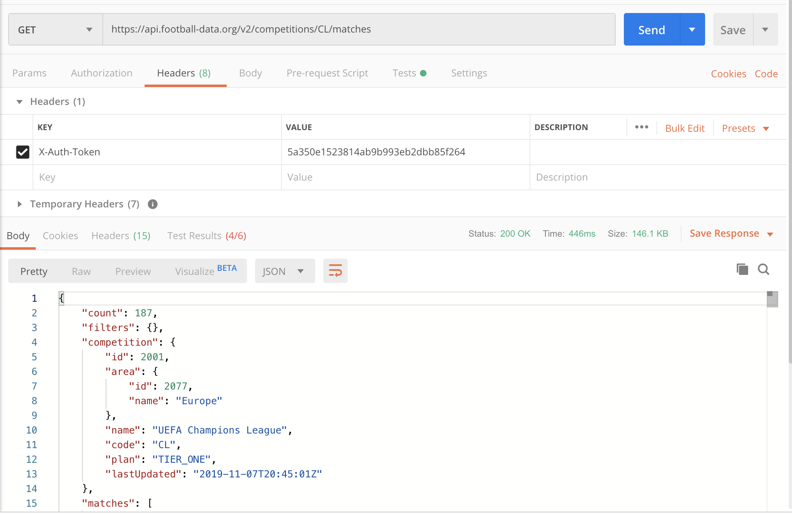
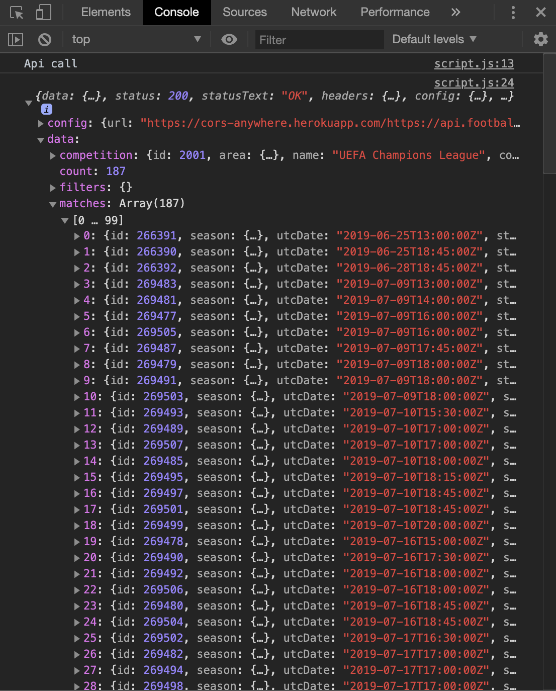
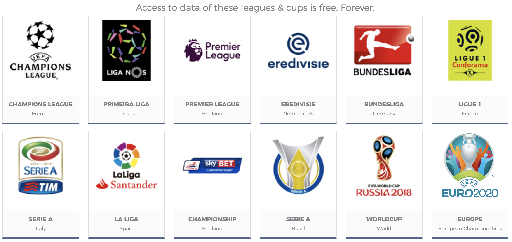

# Working title: "Champions League - Follow Your Team" #

## Wireframes: ##

#### Index ####

Opening page with a header (name of the app + logo). Underneath the header there is going to be a banner with the latest fixtures in the CL. I would love to incorporate something like [AJX 4 - 4 CHL] but instead of the team abbreviation a minilogo/icon. However, this can be part of the future features section. Underneath the header I want a box (display: flex) to create a nice overview of all the teams that were/are active in the CL. As soon as you click on one of the logo's the API query should run and return all the details of that team. 

#### Details ####

To keep everything readable I want the details to be presented on a separate page. Layout should be something like this. Header with team logo + name. Underneath 2 columns / or 1 aside field + main. Aside will contain team information (head coach, players, last fixtures, other relevant available info). Main section will contain out of 3 separate columns. 1st is going to be used for the Group Stage results and/or overview of upcoming matches (date + opponent). 2nd column will show knock-out phase matches and results or future matches (if known). 3rd column will contain 1/4, 1/2 and Final if your team reaches it. Otherwise, I need some nice placeholder that keeps the frame occupied. Or I could make the columns flex based on available content. 

I've verified if all of this information available. For example, all CL matches are available in the API. This also provides the ID of the team (e.g. AJAX = 678). An extra API query provides all information of AJAX (all players and their roles, head coach, team logo)

## API: ##
API: https://www.football-data.org/

Endpoint: https://api.football-data.org/v2/competitions/CL/matches

#### Postmate results ####

#### Console results ####

## Features: ##
Give an overview of how your team is performing in the CL (season 2019 - 2020). 

Show you an overview of the results of past games:
- half time scores
- full time score
- date game
- group

Show you an overview of future games:
- opponent
- date game

Display:
- Full Screen
- Mobile page

## Future features: ##
- Use cookies to save 'your favorite team'
- If a game is played on the day you're visiting:
-- show fixture in the right upper corner
-- otherwise show the last result match played by your team
- Include more competitions / leagues
- Use 2nd api to search for team logos to include
- Include news api that shows latest news about your team
- Include social media api to show latest activity or your team online

## Technology used: ##
- HTML
- CSS
- JavaScript
- Football-data.org API

